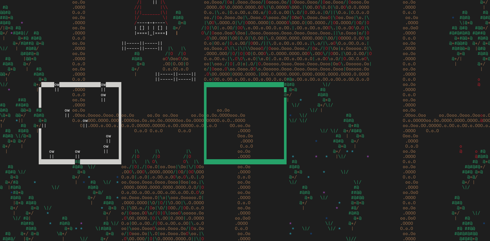
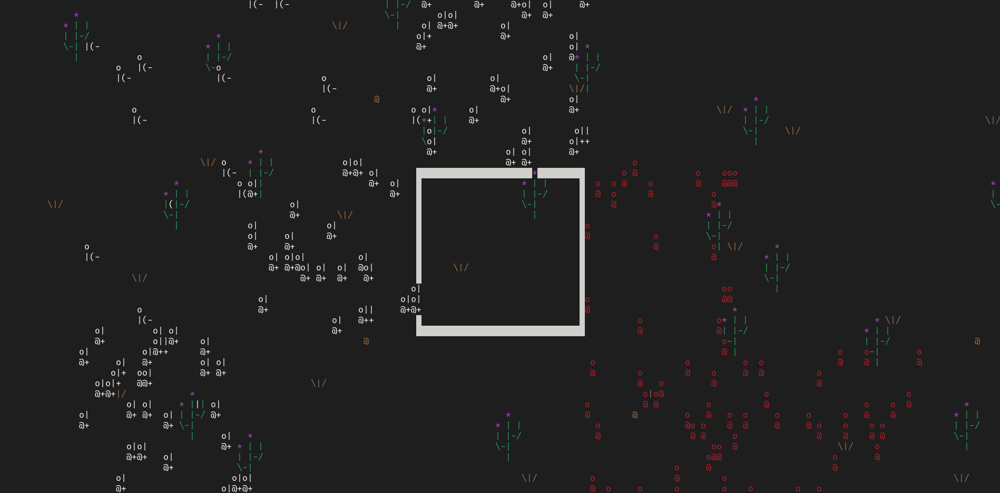
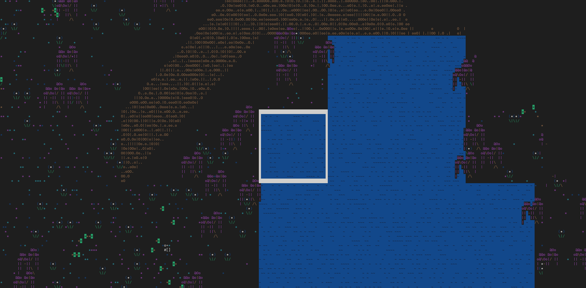
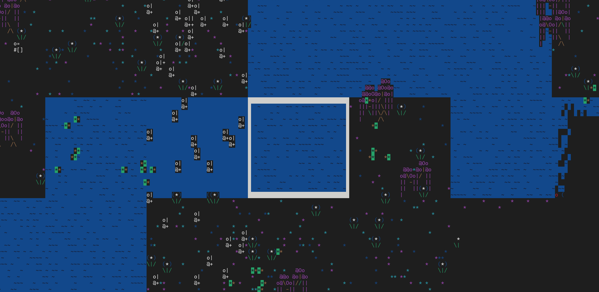
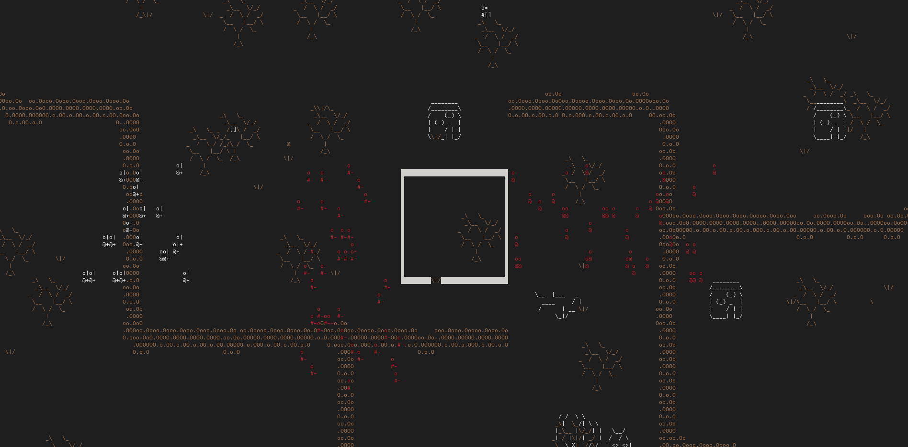

# Lania
*(Work in progress) 2d top-down turn-based strategy terminal game written completely from scratch in C.*

# Screenshots

*(Taken on Fedora Linux in the GNOME terminal)*

# Progress

- [x] Engine
- [x] Game Logic
- [ ] Game Content
    - [x] Tutorial
    - [x] Forest Region
    - [x] Desert Region
    - [x] Enchanted Forest Region
    - [ ] Badlands
        - [x] Rework stage "Western Oasis"
        - [ ] Suburban Defenses
        - [ ] The Goblin Capital
