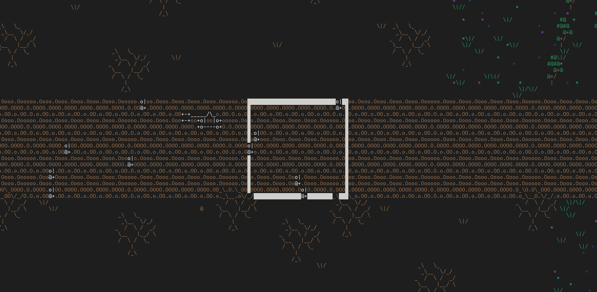

# Lania
*(Work in progress) 2d top-down turn-based strategy terminal game written completely from scratch in C.*

# Screenshots

*(Taken on Fedora Linux in the GNOME terminal)*

# Progress

- [x] Engine
- [x] Game Logic
- [ ] Game Content
    - [x] Forest Region
    - [x] Desert Region
    - [x] Enchanted Forest Region
    - [ ] Badlands
        - [x] Region Concept
        - [x] (Human) Catapult Troop Type
        - [x] (Goblin) Dagger Goblin Troop Type
        - [ ] Stages
            - [x] Remote Oasis
            - [ ] Suburban Defenses
            - [ ] The Goblin Capital
        - [ ] Goblin Commander Pereg
            - Behaves like Obreg (commander for previous region), except:
                - Will try to split troops to get away from a tile that is attackable by human troops
                - Will still move onto tiles that are attackable by human troops, as long as:
                    - If all the human troops that could attack the destination tile `d` were to attack the goblin troops `g` that moved onto `d`, the troops of `g` that remained after the attack must be able to defeat more human troops than the previous attack on `g` did goblin troops in the next turn.